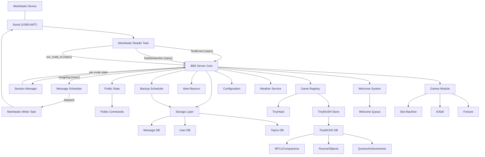

<div align="center">
   
  
   # Meshbbs
  
  **A modern Bulletin Board System for Meshtastic mesh networks**
  
      [](https://github.com/martinbogo/meshbbs/releases)
   [](LICENSE)
   [](https://www.rust-lang.org/)
   [](https://meshtastic.org/)
  
  *Bringing the classic BBS experience to modern mesh networks*
  
   [🚀 Quick Start](#quick-start) • [📖 User Guide](#usage) • [📚 Documentation](docs/) • [🔧 API Reference](https://martinbogo.github.io/meshbbs/api/) • [🤝 Contributing](#contributing) • [💬 Support](#support)
</div>

---

## 🌟 Overview

Meshbbs revolutionizes communication on mesh networks by bringing the beloved Bulletin Board System experience to Meshtastic devices. Exchange messages, participate in forums, and build communities over long-range, low-power radio networks, all without traditional internet infrastructure.

Perfect for emergency communications, remote areas, outdoor adventures, and building resilient community networks.

## 📝 Release Notes

**Version 1.1.2** adds configurable help command keywords to address emergency assistance protocol concerns on some mesh networks.

**Version 1.1.1** completes the data-driven admin system expansion with comprehensive player and object management commands. This release adds critical missing features that enable runtime editing of all game content without code modification.

**Admin System Enhancements:** Three powerful new admin commands (@GIVE, @TELEPORT, @STATS) provide complete player management capabilities. Room and object editing expanded with ownership transfers, visibility controls (including new Hidden visibility mode for secret rooms), housing tag configuration, exit removal, and lock management. All 10 identified gaps in the data-driven system have been implemented.

**Previous Major Release (v1.1.0):** Complete transformation from basic BBS into fully data-driven, production-ready platform with TinyMUSH game engine, systemd/daemon integration, automated welcome system, message replication infrastructure, and comprehensive content management through six admin command interfaces. See full v1.1.0 changelog below for details.

---

**Version 1.1.0** represents a major milestone of development of meshbbs for me... completing the transformation from a basic bulletin board system into a fully data-driven, production-ready platform. This release encompasses both significant **core BBS infrastructure improvements** and a complete **TinyMUSH game engine** with comprehensive content management capabilities. It also measn that I've completely ported the BBS for the third time. In the 90's it was written in Pascal, then I ported it to Java, and now in its third iteration it has been fully ported to Rust!

**Core BBS Platform:** The infrastructure matured significantly with production-ready daemon mode featuring cross-platform graceful shutdown (SIGTERM/SIGHUP/SIGINT on Unix, Ctrl+C/Ctrl+Break on Windows), TTY-aware logging that eliminates duplicate output, and systemd/launchd integration. The automated welcome system greets new mesh nodes with personalized name suggestions (2,500+ combinations of adjectives, animals, and emojis) using a reliable TEXT_MESSAGE_APP ping system with routing ACK verification. Message replication infrastructure was added with unique 6-byte message IDs and CRC-16 integrity checksums, laying the groundwork for future inter-BBS synchronization. Additional improvements include optimized welcome queue processing (10× faster, completing 17-node startup in ~8.5 minutes instead of ~85 minutes), UTF-8 safe message chunking that prevents crashes with multi-byte characters, configurable ident beacons for station identification (5min to 4hour intervals), installation script enhancements with proper password hashing and path layout (`/opt/meshbbs/bin/` and `/opt/meshbbs/scripts/`), and comprehensive configuration validation preventing silent failures.

**TinyMUSH Game Engine:** The centerpiece of 1.1.0 is the complete MUD/MUSH engine with **data-driven content management**, featuring six comprehensive admin command interfaces (@ACHIEVEMENT, @NPC, @COMPANION, @ROOM, @OBJECT, @QUEST/@RECIPE) that enable runtime modification of all game content without recompilation. All seed content now loads from editable JSON files in `data/seeds/` (npcs.json, companions.json, rooms.json, achievements.json, quests.json, recipes.json), supporting modding, version control, and easy customization while maintaining backwards compatibility through hardcoded fallbacks. The game features 20+ interactive rooms, 5 NPCs with dialogue trees, personal per-player landing rooms that prevent collision in shared spaces, tutorial flow improvements requiring explicit NPC interaction, expanded quest content with Phase 4 epic quests (The Cipher, Into the Depths, Master Artisan, The Lost Artifact) offering 87,000+ currency and 1,950 XP rewards, Phase 5 reputation system with 6 factions and 7 levels, advanced trigger system (14 action types with conditional logic), complete economy with currency/shops/trading, companion system with tameable creatures, crafting recipes, and achievement tracking across 6 categories.

## 📚 Documentation

Comprehensive documentation is available in the [`docs/`](docs/) directory and hosted at [GitHub Pages](https://martinbogo.github.io/meshbbs):

- **[Installation Guide](docs/getting-started/installation.md)** - Complete setup instructions
- **[Command Reference](docs/user-guide/commands.md)** - All available commands and usage
- **[API Documentation](https://martinbogo.github.io/meshbbs/api/)** - Generated Rust API docs
- **[Administration Guide](docs/administration/)** - BBS setup and management
- **[Hardware Compatibility](docs/hardware/)** - Supported devices and setup

> The documentation is maintained alongside the code and automatically updated with each release.

See also: [Permissions and third-party notices](PERMISSIONS.md) for external conversation links documenting permission context (e.g., Reddit thread referencing Anycubic ACE Pro RFID tooling).

### Building the API docs locally

You can generate the same Rust API docs on your machine:

1. Ensure Rust is installed (rustup).
2. Run: `cargo doc --no-deps --all-features`
3. Open: `target/doc/meshbbs/index.html`

These docs reflect the inline rustdoc comments throughout the codebase. If you add or change public APIs, please include rustdoc so the generated docs stay complete.

## ✨ Features

### 🔌 **Connectivity & Integration**
- **📡 Meshtastic Integration**: Direct communication via serial (USB/UART)
- **🛎️ Public Discovery + DM Sessions**: Low-noise public channel handshake leading to authenticated Direct Message sessions
- **📨 Broadcast Semantics**: Broadcasts are best‑effort; we can request an ACK and consider any single ACK as basic delivery confirmation (no retries). DMs remain reliable with ACK tracking and retries.
- **⚡ Async Design**: Built with Tokio for high performance
- **🔧 Daemon Mode**: Production-ready background service with graceful shutdown (Linux/macOS)

### 💬 **Communication & Messaging**
- **📚 Message Boards**: Traditional BBS-style message topics and forums
- **🎯 Dynamic Contextual Prompts**: Smart prompts showing current state (`unauth>`, `user@topic>`, `post@topic>`)
- **📜 Enhanced Help System**: `<prefix>HELP` (default `^HELP`) broadcasts all public commands for discovery, with BBS instructions via DM
- **📏 Optimized Message Size**: 230-byte limit optimized for Meshtastic constraints
   - **🎰 Public Slot Machine**: Fun `<prefix>SLOT` mini‑game (default `^SLOT`) with daily coin refills and jackpots
   - **🎱 Magic 8‑Ball (public)**: Ask `<prefix>8BALL` (default `^8BALL`) for a classic, emoji‑prefixed response (broadcast‑only)
   - **🔮 Fortune Cookies (public)**: Use `<prefix>FORTUNE` (default `^FORTUNE`) to get random Unix wisdom, quotes, and humor (broadcast‑only)
   - **🧭 TinyHack (DM)**: Optional ASCII roguelike door reachable via the `[G]ames` submenu (`G1` when enabled); per-user saves under `data/tinyhack/`

### 👥 **User Management & Security**
- **🔐 Robust Security**: Argon2id password hashing with configurable parameters
- **👑 Role-Based Access**: User, Moderator, and Sysop roles with granular permissions
- **🛂 Per-Topic Access Levels**: Config-driven read/post level gating
- **💡 Smart User Experience**: One-time shortcuts reminder, streamlined login flow

### 🛠️ **Administration & Moderation**
- **🧷 Persistent Topic Locks**: Moderators can LOCK/UNLOCK topics; state survives restarts
- **📊 Deletion Audit Log**: `DELLOG` command for accountability tracking using immutable audit logs
- **📈 Network Statistics**: Usage and performance monitoring

## 🚀 Quick Start

> **Prerequisites**: Rust 1.82+, Meshtastic device, USB cable

### 🦀 Installing Rust

Meshbbs requires Rust 1.82 or later. If you don't have Rust installed:

**Linux & macOS:**
```bash
curl --proto '=https' --tlsv1.2 -sSf https://sh.rustup.rs | sh
```

**Windows:**
Download and run [rustup-init.exe](https://rustup.rs/) from the official Rust website.

**All Platforms:**
For detailed installation instructions, visit the official Rust installation guide:
- 🌐 **[https://www.rust-lang.org/tools/install](https://www.rust-lang.org/tools/install)**

After installation, verify Rust is installed:
```bash
rustc --version
cargo --version
```

### 📦 Installation

**Option 1: Automated Installation (Linux/Raspberry Pi - Recommended)**

For Linux systems and Raspberry Pi, use the provided installation script:

```bash
# Clone the repository
git clone --recurse-submodules https://github.com/martinbogo/meshbbs.git
cd meshbbs

# Run the installer (will prompt for configuration)
sudo ./install.sh
```

The installer will:
- Build the release binary
- Create necessary directories
- Guide you through configuration (sysop password, serial port, etc.)
- Set up systemd service for automatic startup
- Install to `/opt/meshbbs`

**Option 2: Manual Installation (All Platforms)**

```bash
# Clone the repository
git clone --recurse-submodules https://github.com/martinbogo/meshbbs.git
cd meshbbs

# Build the project
cargo build --release

# Copy example configuration
cp config.example.toml config.toml

# Edit configuration (see below)
nano config.toml
```
### ⚙️ Configure Your BBS

**Automated Installation (Linux/Raspberry Pi):**
The `install.sh` script handles most configuration automatically during installation:
- ✅ Sysop password (prompted during install, securely hashed)
- ✅ Serial port selection (interactive menu)
- ✅ Basic BBS settings with sensible defaults
- ✅ Data directories and permissions
- ✅ Systemd service configuration

**Post-Installation Customization:**
After running the installer, you should customize these settings in `/opt/meshbbs/config.toml`:

1. **🎯 BBS Identity** - Personalize your BBS:
   ```toml
   [bbs]
   name = "Your BBS Name"         # Change from default
   location = "Your Location"     # Update location
   description = "Your BBS info"  # Add description
   welcome_message = "Welcome!"   # Customize welcome
   ```

2. **🌤️ Weather Setup** - Enable weather features (optional):
   ```toml
   [weather]
   api_key = "your_api_key_here"  # Get free at openweathermap.org
   enabled = true                 # Set to true after adding API key
   default_location = "Portland"  # Your default city
   location_type = "city"         # "city", "zipcode", or "city_id"
   country_code = "US"           # Optional country code
   ```

3. **📡 Fine-tune Meshtastic** - Adjust timing if needed:
   ```toml
   [meshtastic]
   port = "/dev/ttyUSB0"          # Already set by installer
   min_send_gap_ms = 2000         # Minimum gap between sends
   dm_resend_backoff_seconds = [4, 8, 16]  # DM retry timing
   ```

**Manual Installation (All Platforms):**
If you didn't use the installer, configure these critical settings:

```bash
# Copy example configuration
cp config.example.toml config.toml
nano config.toml
```

1. **📡 Serial Port** - Set your Meshtastic device port:
   ```toml
   [meshtastic]
   port = "/dev/ttyUSB0"    # Linux: /dev/ttyUSB0 or /dev/ttyACM0
                            # macOS: /dev/tty.usbserial-*
                            # Windows: COM3, COM4, etc.
   ```

2. **🔐 Sysop Password** - Set your admin password:
   ```bash
   ./target/release/meshbbs sysop-passwd
   ```
   This will prompt for a password and update the `sysop_password_hash` field in config.toml.

### 🚀 Start Your BBS

**Automated Installation (systemd):**
```bash
# Enable and start the service
sudo systemctl enable --now meshbbs

# Check status and view logs
sudo systemctl status meshbbs
sudo journalctl -u meshbbs -f
```

**Manual Installation:**
```bash
# Start the BBS server
./target/release/meshbbs start

# Or run in daemon mode (background)
./target/release/meshbbs start --daemon
```

> For complete command reference, see the [Command Line Interface](#command-line-interface) section below.

## ⚙️ Configuration

Meshbbs uses a `config.toml` file for all settings.

**Configuration File Locations:**
- **Installed via install.sh:** `/opt/meshbbs/config.toml`
- **Manual installation:** `./config.toml` (in project directory)

**Setup Methods:**
- **Automated:** Use `install.sh` (Linux/Raspberry Pi) - creates config with interactive prompts
- **Manual:** Copy `config.example.toml` to `config.toml` and edit as needed

Topics are managed in `data/topics.json` (runtime store) and are seeded automatically on first startup. Manage topics interactively from within the BBS; existing installations with `[message_topics.*]` in TOML remain supported for backward compatibility (they'll be merged into the runtime store at startup).

<details>
<summary><strong>📋 View Example Configuration</strong></summary>

```toml
[bbs]
name = "meshbbs Station"
sysop = "sysop"
location = "Your Location" 
description = "A bulletin board system for mesh networks"
max_users = 100             # Hard cap on concurrent logged-in sessions
session_timeout = 10        # Minutes of inactivity before auto-logout
welcome_message = "Welcome to Meshbbs! Type HELP for commands."

[meshtastic]
port = "/dev/ttyUSB0"
baud_rate = 115200
# node_id = "0x1234ABCD"   # optional; used only as display fallback before radio reports its ID
channel = 0
min_send_gap_ms = 2000                  # Enforced minimum between sends (ms)
dm_resend_backoff_seconds = [4, 8, 16]  # Reliable DM retry schedule (s)
post_dm_broadcast_gap_ms = 1200         # Delay broadcast after DM (ms)
dm_to_dm_gap_ms = 600                   # Gap between DMs (ms)
help_broadcast_delay_ms = 3500          # Delay HELP public broadcast after DM (ms)

[storage]
data_dir = "./data"
max_message_size = 230        # Protocol hard cap

[weather]
api_key = "your_openweathermap_api_key"   # Get free at openweathermap.org
default_location = "Portland"             # City name, zipcode, or city ID  
location_type = "city"                    # "city", "zipcode", or "city_id"
country_code = "US"                       # Optional country code
cache_ttl_minutes = 10                    # Cache weather data (minutes)
timeout_seconds = 5                       # API request timeout
enabled = true                            # Enable weather functionality

[logging]
level = "info"
file = "meshbbs.log"
```
</details>

### 🎛️ Key Configuration Options

| Section | Purpose | Key Settings |
|---------|---------|--------------|
| `[bbs]` | Basic BBS settings | `name`, `sysop`, `sysop_password_hash`, `max_users`, `session_timeout`, `welcome_message`, `public_command_prefix`, `allow_public_login` |
| `[meshtastic]` | Device connection & timing | `port`, `baud_rate`, `channel`, `min_send_gap_ms`, `dm_resend_backoff_seconds` |
| `[ident_beacon]` | Station identification | `enabled`, `frequency` (5min to 4hours) |
| `[storage]` | Data management | `data_dir`, `max_message_size` |
| `[logging]` | Log configuration | `level` (trace/debug/info/warn/error), `file` |
| `[games]` | Game features | `tinyhack_enabled`, `tinymush_enabled`, `tinymush_db_path` |
| `[weather]` | OpenWeatherMap integration | `api_key`, `enabled`, `default_location`, `location_type`, `country_code` |
| `[welcome]` | Automated welcomes | `enabled`, `public_greeting`, `private_guide`, `cooldown_minutes`, `max_welcomes_per_node` |

#### 📡 Critical BBS Settings

**`[bbs]` section:**
- **`name`**: Your BBS display name (shown to users)
- **`sysop`**: Admin username (created automatically with admin privileges)
- **`sysop_password_hash`**: Argon2id hash (set by installer or `meshbbs sysop-passwd`)
- **`public_command_prefix`**: Single character for public commands (default `^`)
- **`allow_public_login`**: Security setting - false requires DM-only login
- **`max_users`**: Maximum concurrent sessions
- **`session_timeout`**: Minutes of inactivity before auto-logout

#### ⚡ Meshtastic Timing Controls

**Fairness / Writer Tuning Fields** in `[meshtastic]`:

These pacing controls reduce airtime contention and avoid triggering device/network rate limits:

* **`min_send_gap_ms`**: Global enforced minimum between any two text sends (hard floor 2000ms)
* **`dm_resend_backoff_seconds`**: Retry schedule for reliable DM ACKs (default `[4,8,16]` seconds)
* **`post_dm_broadcast_gap_ms`**: Additional gap before broadcast after DM (default 1200ms)
* **`dm_to_dm_gap_ms`**: Gap enforced between consecutive DMs (default 600ms)
* **`help_broadcast_delay_ms`**: Delay for public HELP notice after DM reply (default 3500ms)

#### 🎮 Game Configuration

**`[games]` section:**
- **`tinyhack_enabled`**: Enable TinyHack roguelike (accessible via Games menu)
- **`tinymush_enabled`**: Enable TinyMUSH MUD/MUSH engine
- **`tinymush_db_path`**: Optional override for TinyMUSH database location

#### 📻 Ident Beacon

**`[ident_beacon]` section:**
- **`enabled`**: Periodic station identification broadcasts
- **`frequency`**: Options: "5min", "15min", "30min", "1hour", "2hours", "4hours"

#### 👋 Welcome System

**`[welcome]` section:**
- **`enabled`**: Auto-greet new nodes with default "Meshtastic XXXX" names
- **`public_greeting`**: Broadcast welcome on public channel
- **`private_guide`**: Send setup instructions via DM
- **`cooldown_minutes`**: Global rate limit between any welcomes (prevents spam)
- **`max_welcomes_per_node`**: Maximum times to welcome the same node

#### 📊 Storage & Logging

**`[storage]` section:**
- **`data_dir`**: Directory for all runtime data (messages, users, backups)
- **`max_message_size`**: Protocol hard cap in bytes (230 for Meshtastic)

**`[logging]` section:**
- **`level`**: Log verbosity (trace, debug, info, warn, error)
- **`file`**: Log file path (recommended for production)

**Note:** Topics are managed in `data/topics.json` (runtime store) and seeded automatically on first startup. Manage topics interactively from within the BBS.

## 📖 Usage

### 🎮 Command Line Interface

**Service Management (Installed via install.sh):**
```bash
# Start/stop/restart service
sudo systemctl start meshbbs
sudo systemctl stop meshbbs
sudo systemctl restart meshbbs

# Enable auto-start on boot
sudo systemctl enable meshbbs

# Check status
sudo systemctl status meshbbs

# View logs (live)
sudo journalctl -u meshbbs -f

# View recent logs
sudo journalctl -u meshbbs -n 100
```

**Direct Commands:**
```bash
# Manual start (without systemd)
meshbbs start                              # Use config.toml settings
meshbbs start --port /dev/ttyUSB0          # Override serial port
meshbbs start --daemon                     # Run in background (Linux/macOS)

# Administration
meshbbs sysop-passwd                       # Set/update sysop password
meshbbs hash-password                      # Hash password from stdin (scripts)

# Diagnostics
meshbbs check-device --port /dev/ttyUSB0   # Test device connectivity
meshbbs status                             # Show server statistics
meshbbs -vv start                          # Enable verbose logging
```

> **Note for installed systems:** Use full paths like `/opt/meshbbs/bin/meshbbs` when the service is running, and stop the service first before running diagnostic commands.

### 📡 Connecting via Meshtastic

Meshbbs uses a **two-step interaction model** that keeps the shared mesh channel quiet while enabling rich private sessions.

#### 🔍 **Step 1: Say Hello on the Public Channel**
Commands require a prefix to address the BBS. The default is `^`, but your sysop can set a different one in `bbs.public_command_prefix`:
- `<prefix>HELP` - Shows all public commands and BBS login info (default `^HELP`)
- `<prefix>LOGIN <username>` - Registers pending login for your node ID (default `^LOGIN`)
- `<prefix>WEATHER` - Get current weather information (default `^WEATHER`)
 - `<prefix>SLOT` / `<prefix>SLOTMACHINE` - Spin the emoji slot machine (costs 5 coins; daily refill to 100 when at 0) (default `^SLOT`)
 - `<prefix>SLOTSTATS` - Show your slot coin balance, wins, and jackpots (default `^SLOTSTATS`)
- `<prefix>8BALL <question>` - Magic 8-Ball oracle for life's mysteries (default `^8BALL`)
- `<prefix>FORTUNE` - Receive random wisdom and inspiration (default `^FORTUNE`)

#### 💬 **Step 2: Start Your Private Conversation**
After public `LOGIN`, open a private message to the BBS node to start your authenticated session.

#### 🎛️ Compact Message UI (DM Session)

Once logged in via DM, use the compact, single-letter flow:

- Topics (press M)
   - Digits 1‑9: select topic on the current page (root topics only)
   - Topics with children show a ‘›’ marker; selecting opens Subtopics
   - L: more topics, H: help, B: back, X: exit
   
  Subtopics
   - Digits 1‑9: select subtopic; nested levels supported
   - U/B: up one level; M: back to root Topics; L: more
- Threads (inside a topic)
   - Digits 1‑9: read thread
   - N: new thread (2 steps: title ≤32, then body ≤200)
   - F <text>: filter thread titles (repeat F to clear)
   - L: more, B: back (to Subtopics or Topics), M: topics, H: help
- Read view
   - +: next, -: prev, Y: reply, B: back, H: help
   - Shows the latest reply preview (prefixed with "- ")

Shortcuts:
- HELP / HELP+: compact vs. verbose help
- WHERE / W: show breadcrumb path, e.g. `[BBS] You are at: Meshbbs > Topics > hello > Threads`

Indicators:
- Topics list shows per-topic new message counts since your last login, e.g. `1. general (2)`
- Threads list shows a `*` on titles with new content since your last login

<details>
<summary><strong>📋 Complete Command Reference</strong></summary>

**Authentication Commands:**
```bash
LOGIN <user> [pass]       # Authenticate (set password if first time)
REGISTER <user> <pass>    # Create new account
LOGOUT                    # End session
CHPASS <old> <new>        # Change password
SETPASS <new>             # Set initial password (passwordless accounts)
```

**Navigation & Help:**
```bash
HELP / H / ?              # Compact help with shortcuts
HELP+ / HELP V            # Verbose help (chunked if needed)
M                         # Open message topics list
1-9                       # Pick a topic/thread from the current page
L                         # Load more topics/threads (next page)
WHERE / W                 # Show current breadcrumb path
U / B                     # Up/back (to parent menu)
Q                         # Quit/logout
```

**Message & Thread Actions:**
```bash
R                         # View recent messages in the current topic
P                         # Compose a new post in the current topic
N                         # Start a new thread from the threads list
Y                         # Reply when reading a thread
F <text>                  # Filter topics/threads by text
+ / -                     # Next/previous page within lists
.                         # Finish posting (if text already sent) or cancel
```

**Moderator Commands** (level ≥5):
```bash
D<n>                      # Delete the nth thread/message (with confirm)
P<n>                      # Pin/unpin the nth thread
R<n> <title>              # Rename a thread
K                         # Toggle topic lock in the current area
DL [page] / DELLOG [p]    # View deletion audit entries
```

**Sysop Commands** (level 10):
```bash
G @user=LEVEL|ROLE        # Grant a level (1/5/10) or role (USER/MOD/SYSOP)
USERS [pattern]           # List users (optional filter)
USERINFO <user>           # Show details for a user
WHO                       # List currently logged-in users
SESSIONS                  # Show active sessions
KICK <user>               # Disconnect a user session
BROADCAST <message>       # Send a broadcast to all users
SYSLOG <INFO|WARN|ERROR> <msg>  # Write to the admin/security log
ADMIN / DASHBOARD         # Summary of system statistics
```
</details>

### 🎯 Dynamic Prompts

Meshbbs shows contextual prompts that reflect your current state:

| Prompt | Meaning |
|--------|---------|
| `unauth>` | Not logged in |
| `alice (lvl1)>` | Logged in as alice, user level 1 |
| `alice@general>` | Reading messages in 'general' topic |
| `post@general>` | Posting a message to 'general' topic |

### 📏 Message Size Limit

Each outbound message (body + optional newline + dynamic prompt) is limited to **230 bytes** (not characters) to match Meshtastic constraints. Multi‑byte UTF‑8 characters reduce visible character count. The server applies a UTF‑8 safe clamp at send‑time and then appends the prompt, ensuring frames always fit.

Reply storage is structured and backward compatible: new replies record `timestamp`, `author`, and `content`, while legacy plain-string replies continue to display correctly.

## 🏗️ Architecture

Meshbbs is built with a clean, modular architecture in Rust:



### 📁 Module Structure

- **`bbs/`**: Core BBS functionality and user interface
- **`meshtastic/`**: Meshtastic device communication layer
  - Parses protobuf frames and emits structured `TextEvent` items
- **`storage/`**: Message and file storage subsystem  
- **`config/`**: Configuration management

## 🛠️ Development

### 🔧 Building from Source

```bash
# Development build
cargo build

# Optimized release build
cargo build --release

# Run comprehensive test suite
cargo test

# Run with debug logging
RUST_LOG=debug cargo run -- start
```

### 🎛️ Feature Flags

Control optional functionality with Cargo features:

| Feature | Default | Description |
|---------|---------|-------------|
| `serial` | ✅ | Serial port communication |
| `meshtastic-proto` | ✅ | Protobuf parsing of Meshtastic packets |
| `weather` | ✅ | Real-time weather via OpenWeatherMap API |
| `api-reexports` | ✅ | Re-export internal types |

```bash
# Minimal build without optional features
cargo build --no-default-features

# Build with specific features only
cargo build --features "serial,weather"
```

### 📡 Meshtastic Protobuf Integration

For rich packet handling, enable the `meshtastic-proto` feature. Upstream protobuf definitions are included as a git submodule.

<details>
<summary><strong>🔧 Protobuf Setup Instructions</strong></summary>

**Fresh clone with submodules:**
```bash
git clone --recurse-submodules https://github.com/martinbogo/meshbbs.git
```

**Initialize submodules in existing clone:**
```bash
git submodule update --init --recursive
```

**Build with protobuf support:**
```bash
cargo build --features meshtastic-proto
```

**Update submodules:**
```bash
git submodule update --remote third_party/meshtastic-protobufs
git add third_party/meshtastic-protobufs
git commit -m "chore(deps): bump meshtastic protobufs"
```

**Use custom proto directory:**
```bash
MESHTASTIC_PROTO_DIR=path/to/protos cargo build --features meshtastic-proto
```
</details>

### 📂 Project Structure

```
meshbbs/
├── 📄 src/
│   ├── main.rs             # Application entry point
│   ├── lib.rs              # Library exports
│   ├── logutil.rs          # Logging utilities
│   ├── metrics.rs          # Performance metrics
│   ├── validation.rs       # Input validation helpers
│   ├── 🎮 bbs/             # Core BBS functionality
│   │   ├── server.rs       # BBS server implementation
│   │   ├── session.rs      # User session management
│   │   ├── commands.rs     # BBS command processing
│   │   ├── dispatch.rs     # Command routing
│   │   ├── public.rs       # Public channel command parsing
│   │   ├── roles.rs        # User role definitions
│   │   ├── games.rs        # Game system integration
│   │   ├── game_registry.rs # Game registration system
│   │   ├── tinyhack.rs     # TinyHack roguelike game
│   │   ├── slotmachine.rs  # Slot machine mini-game
│   │   ├── eightball.rs    # Magic 8-Ball game
│   │   ├── fortune.rs      # Fortune cookie system
│   │   ├── weather.rs      # Weather service integration
│   │   └── welcome.rs      # Welcome message system
│   ├── 📡 meshtastic/      # Meshtastic integration
│   │   ├── framer.rs       # Frame protocol handling
│   │   ├── slip.rs         # SLIP encoding
│   │   └── mod.rs          # Meshtastic module
│   ├── 💾 storage/
│   │   └── mod.rs          # Data persistence layer
│   ├── ⚙️ config/
│   │   └── mod.rs          # Configuration management
│   ├── 🎭 tmush/           # TinyMUSH game engine
│   │   ├── mod.rs          # TinyMUSH module
│   │   ├── types.rs        # Core data types
│   │   ├── state.rs        # Game state management
│   │   ├── storage.rs      # TinyMUSH data persistence
│   │   ├── commands.rs     # Player commands
│   │   ├── builder_commands.rs # World-building commands
│   │   ├── resolver.rs     # Object resolution
│   │   ├── room_manager.rs # Room management
│   │   ├── inventory.rs    # Inventory system
│   │   ├── achievement.rs  # Achievement tracking
│   │   ├── companion.rs    # Companion system
│   │   ├── quest.rs        # Quest system
│   │   ├── shop.rs         # Shop/trading system
│   │   ├── currency.rs     # Currency management
│   │   ├── housing_cleanup.rs # Housing lifecycle
│   │   ├── clone.rs        # Object cloning
│   │   ├── tutorial.rs     # Tutorial system
│   │   ├── migration.rs    # Data migration
│   │   ├── seed_loader.rs  # JSON seed content loader
│   │   ├── errors.rs       # Error types
│   │   └── trigger/        # Trigger system
│   └── 📋 protobuf/
│       └── mod.rs          # Protobuf definitions
├── 📚 docs/                # Project documentation (GitHub Pages)
│   ├── getting-started/
│   ├── user-guide/
│   ├── administration/
│   ├── hardware/
│   ├── development/
│   └── qa/
├── 🖼️ images/
│   └── meshbbs_logo.png
├── 🧰 scripts/
│   ├── meshbbs-daemon.sh   # Daemon management script
│   ├── clean_workspace.sh  # Workspace cleanup
│   ├── init_npc_dialogues.sh # NPC dialogue initialization
│   └── check_utf8_budget.py  # UTF-8 budget validation
├── 🔧 third_party/
│   └── meshtastic-protobufs/ # Upstream protobuf definitions
├── 📦 protos/              # Local proto placeholders
│   ├── meshtastic_placeholder.proto
│   └── README.md
├── 🧪 tests/               # Integration tests
│   ├── achievement_*.rs    # Achievement system tests
│   ├── admin_commands.rs   # Admin command tests
│   ├── auth_password.rs    # Authentication tests
│   ├── bulletin_board_*.rs # BBS functionality tests
│   ├── companion_*.rs      # Companion system tests
│   ├── eightball_behavior.rs # 8ball game tests
│   ├── fortune_behavior.rs # Fortune game tests
│   ├── tinyhack_*.rs       # TinyHack game tests
│   ├── tinymush_*.rs       # TinyMUSH integration tests
│   ├── common.rs           # Shared test utilities
│   └── test_data/          # Test fixtures and data
├── 📊 data/                # Runtime data (auto-created)
│   ├── topics.json         # Forum topics (runtime)
│   ├── users/              # User accounts
│   ├── messages/           # Message storage
│   ├── files/              # File attachments
│   ├── tinymush/           # TinyMUSH database
│   └── seeds/              # Seed content (JSON)
│       ├── npcs.json       # NPC definitions
│       ├── companions.json # Companion definitions
│       ├── rooms.json      # Room definitions
│       ├── achievements.json # Achievement definitions
│       ├── quests.json     # Quest definitions
│       └── recipes.json    # Crafting recipe definitions
├── 📦 packaging/           # Distribution packaging
│   └── runtime-skel/       # Runtime skeleton structure
├── 📋 examples/
│   └── test_weather.rs     # Weather API example
├── �️ archive/            # Historical artifacts
│   ├── development-logs/
│   └── one-time-scripts/
├── �🛠️ build.rs            # Build script
├── 📦 Cargo.toml          # Rust package manifest
├── 📦 Cargo.lock          # Dependency lock file
├── ⚙️ config.example.toml # Example configuration
├── �️ topics.example.json # Example topics
├── 🚀 install.sh          # Installation script
├── 🗑️ uninstall.sh        # Uninstallation script
├── 🗒️ CHANGELOG.md        # Version history
├── 📘 README.md           # This file
├── 📋 CONTRIBUTING.md     # Contribution guidelines
├── 📝 LICENSE             # License information
├── 📋 Justfile            # Just command runner config
└── 📋 Cross.toml          # Cross-compilation config
```

## 🗺️ Roadmap

### ✅ Recent Releases
- **v1.0.0 BETA** (2025-09-25): First public beta of the 1.x series

### 🚀 Upcoming Features
- [ ] **🔐 Locally encrypted data storage**: Enhanced security for stored messages and user data
- [ ] **📶 Support connecting node via WiFi and Ethernet**

## 💻 Hardware Compatibility

Meshbbs has been tested on the following Meshtastic devices:

| Device | Status |
|--------|--------|
| **Heltec V3** | ✅ Tested |
| **Heltec T114** | ✅ Tested |
| **LilyGO T-Deck** | ✅ Tested |
| **LilyGO T-Beam** | ✅ Tested |
| **RAK WisBlock** | ✅ Tested |

> **Other Meshtastic devices**: Meshbbs should work with any Meshtastic-compatible device, but we'd love to hear about your experiences adapting the BBS to other hardware! Please share your results in the discussions or issues.

## 🤝 Contributing

We welcome contributions from the community! Here's how to get started:

### 🚀 Quick Contribution Guide

1. **🍴 Fork** the repository
2. **🌟 Create** a feature branch: `git checkout -b feature/amazing-feature`
3. **💻 Make** your changes with tests
4. **✅ Test** your changes: `cargo test && cargo clippy`
5. **📝 Commit** with clear messages: `git commit -m 'feat: add amazing feature'`
6. **📤 Push** to your branch: `git push origin feature/amazing-feature`
7. **🔄 Submit** a Pull Request

### 📋 Development Guidelines

- Follow Rust best practices and idioms
- Add tests for new functionality
- Update documentation for user-facing changes
- Run `cargo fmt` and `cargo clippy` before committing
- Keep commits focused and atomic

**Note**: All code contributions require appropriate unit tests.

See [CONTRIBUTING.md](CONTRIBUTING.md) for detailed guidelines.

## 📄 License

<div align="center">

[](https://creativecommons.org/licenses/by-nc/4.0/)

</div>

This project is licensed under the **Creative Commons Attribution-NonCommercial 4.0 International License**.

**You are free to:**
- ✅ **Share** - copy and redistribute in any medium or format
- ✅ **Adapt** - remix, transform, and build upon the material

**Under these terms:**
- 🏷️ **Attribution** - Give appropriate credit and indicate changes
- 🚫 **NonCommercial** - No commercial use without permission

See the [LICENSE](LICENSE) file or visit [CC BY-NC 4.0](https://creativecommons.org/licenses/by-nc/4.0/) for details.

## 🙏 Acknowledgments

Special thanks to the projects and communities that make meshbbs possible:

- 🌐 **[Meshtastic](https://meshtastic.org/)** - The open source mesh networking project
- ⚡ **[Tokio](https://tokio.rs/)** - Asynchronous runtime for Rust  
- 📻 **Amateur Radio Community** - For mesh networking innovations
- 🦀 **Rust Community** - For the amazing language and ecosystem

## 💬 Support

<div align="center">

**Need help? We're here for you!**

[](mailto:martinbogo@gmail.com)
[](https://github.com/martinbogo/meshbbs/issues)
[](https://martinbogo.github.io/meshbbs)

</div>

### 🐛 Bug Reports
Found a bug? Please [open an issue](https://github.com/martinbogo/meshbbs/issues/new) with:
- Steps to reproduce
- Expected vs actual behavior  
- System information (OS, Rust version, device model)
- Relevant log output

### 💡 Feature Requests
Have an idea? We'd love to hear it! [Start a discussion](https://github.com/martinbogo/meshbbs/discussions) or create an issue.

### 🆘 Getting Help
- Check the [Documentation](docs/) for comprehensive guides
- Browse the [API Reference](https://martinbogo.github.io/meshbbs/meshbbs/) for technical details
- Search existing [Issues](https://github.com/martinbogo/meshbbs/issues) for solutions
- Join the discussion in [GitHub Discussions](https://github.com/martinbogo/meshbbs/discussions)

---

<div align="center">
  
**🎯 Meshbbs - Bringing bulletin board systems to the mesh networking age! 📡**

*Built with ❤️ for the mesh networking community*

[](https://www.rust-lang.org/)
[](https://meshtastic.org/)

</div>
