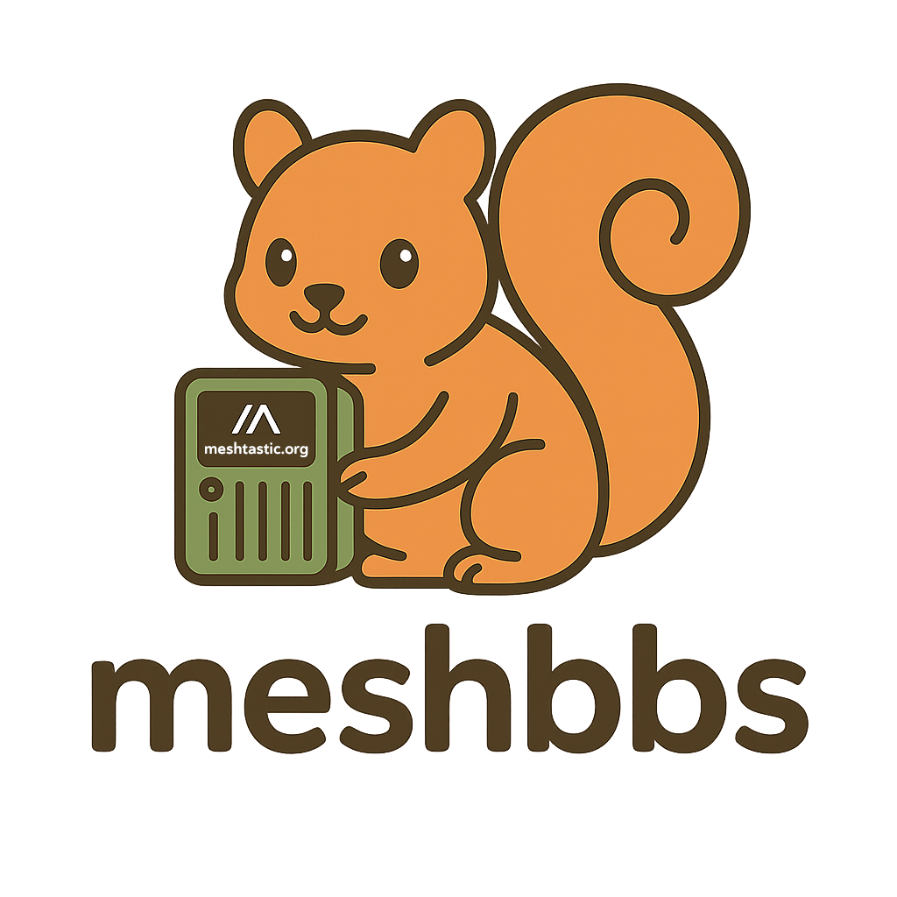
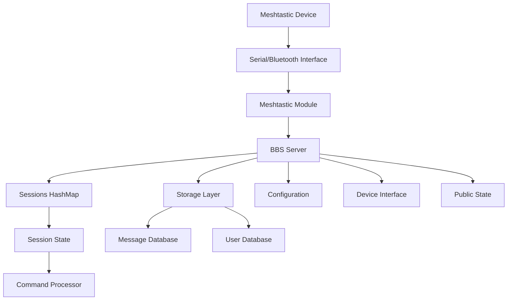

<div align="center">
   
  
   # Meshbbs
  
  **A modern Bulletin Board System for Meshtastic mesh networks**
  
   [](https://github.com/martinbogo/meshbbs/releases)
  [](LICENSE)
  [](https://www.rust-lang.org/)
  [](https://meshtastic.org/)
  
  *Bringing the classic BBS experience to modern mesh networks*
  
  [🚀 Quick Start](#quick-start) • [📖 User Guide](#usage) • [📚 Documentation](docs/) • [🔧 API Reference](https://martinbogo.github.io/meshbbs/meshbbs/) • [🤝 Contributing](#contributing) • [💬 Support](#support)
</div>

---

## 🌟 Overview

Meshbbs revolutionizes communication on mesh networks by bringing the beloved Bulletin Board System experience to Meshtastic devices. Exchange messages, participate in forums, and build communities over long-range, low-power radio networks—all without traditional internet infrastructure.

Perfect for emergency communications, remote areas, outdoor adventures, and building resilient community networks.

## 📚 Documentation

Comprehensive documentation is available in the [`docs/`](docs/) directory and hosted at [GitHub Pages](https://martinbogo.github.io/meshbbs):

- **[Installation Guide](docs/getting-started/installation.md)** - Complete setup instructions
- **[Command Reference](docs/user-guide/commands.md)** - All available commands and usage
- **[API Documentation](https://martinbogo.github.io/meshbbs/meshbbs/)** - Generated Rust API docs
- **[Administration Guide](docs/administration/)** - BBS setup and management
- **[Hardware Compatibility](docs/hardware/)** - Supported devices and setup

> The documentation is maintained alongside the code and automatically updated with each release.

### Building the API docs locally

You can generate the same Rust API docs on your machine:

1. Ensure Rust is installed (rustup).
2. Run: `cargo doc --no-deps --all-features`
3. Open: `target/doc/meshbbs/index.html`

These docs reflect the inline rustdoc comments throughout the codebase. If you add or change public APIs, please include rustdoc so the generated docs stay complete.

## ✨ Features

### � **Connectivity & Integration**
- **📡 Meshtastic Integration**: Direct communication via serial or Bluetooth
- **🛎️ Public Discovery + DM Sessions**: Low-noise public channel handshake leading to authenticated Direct Message sessions
- **📨 Broadcast Semantics**: Broadcasts are best‑effort; we can request an ACK and consider any single ACK as basic delivery confirmation (no retries). DMs remain reliable with ACK tracking and retries.
- **⚡ Async Design**: Built with Tokio for high performance

### 💬 **Communication & Messaging**
- **📚 Message Boards**: Traditional BBS-style message topics and forums
- **🎯 Dynamic Contextual Prompts**: Smart prompts showing current state (`unauth>`, `user@topic>`, `post@topic>`)
- **📜 Enhanced Help System**: `^HELP` broadcasts all public commands for discovery, with BBS instructions via DM
- **📏 Optimized Message Size**: 230-byte limit optimized for Meshtastic constraints
 - **🎰 Public Slot Machine**: Fun `^SLOT` mini‑game with daily coin refills and jackpots
 - **🎱 Magic 8‑Ball (public)**: Ask `^8BALL` for a classic, emoji‑prefixed response (broadcast‑only)
 - **🔮 Fortune Cookies (public)**: Use `^FORTUNE` to get random Unix wisdom, quotes, and humor (broadcast‑only)
 - **✅ Broadcast ACK Confirmation (optional)**: Broadcasts can now request an ACK and treat any single ACK as “at least one hop” success; lightweight tracking with short TTL and new metrics (see below)

### 👥 **User Management & Security**
- **🔐 Robust Security**: Argon2id password hashing with configurable parameters
- **👑 Role-Based Access**: User, Moderator, and Sysop roles with granular permissions
- **🛂 Per-Topic Access Levels**: Config-driven read/post level gating
- **💡 Smart User Experience**: One-time shortcuts reminder, streamlined login flow

### 🛠️ **Administration & Moderation**
- **🧷 Persistent Topic Locks**: Moderators can LOCK/UNLOCK topics; state survives restarts
- **📊 Deletion Audit Log**: `DELLOG` command for accountability tracking
- **📈 Network Statistics**: Usage and performance monitoring
- **🌤️ Weather Integration**: Real-time weather via OpenWeatherMap API with intelligent caching

## 🚀 Quick Start

> **Prerequisites**: Rust 1.82+, Meshtastic device, USB cable or Bluetooth connection

### 📦 Installation

```bash
# Clone the repository
git clone --recurse-submodules https://github.com/martinbogo/meshbbs.git
cd meshbbs

# Build the project
cargo build --release

# Initialize the BBS configuration
./target/release/meshbbs init
```

### ⚙️ Configure Your BBS

After initialization, edit the `config.toml` file to set up your BBS:

```bash
# Open config.toml in your preferred editor
nano config.toml  # or vim, code, etc.
```

**Critical settings to configure:**

1. **📡 Meshtastic Connection** - Update your serial port:
   ```toml
   [meshtastic]
   port = "/dev/ttyUSB0"  # Change to your device port
   # macOS: often /dev/tty.usbserial-*
   # Windows: often COM3, COM4, etc.
   # Linux: often /dev/ttyUSB0, /dev/ttyACM0
   ```

2. **👑 Sysop Information** - Set your admin details:
   ```toml
   [bbs]
   name = "Your BBS Name"
   sysop = "sysop"  # This becomes your admin username
   location = "Your Location"
   ```

4. **🌤️ Weather Setup** - Configure OpenWeatherMap integration:
   ```toml
   [weather]
   api_key = "your_openweathermap_api_key"  # Get free at openweathermap.org
   default_location = "Portland"            # City name, zipcode, or city ID
   location_type = "city"                   # "city", "zipcode", or "city_id"
   country_code = "US"                      # Optional country code
   enabled = true                           # Enable weather functionality
   ```

3. **🔐 Set Sysop Password** - Secure your admin account:
   ```bash
   ./target/release/meshbbs sysop-passwd
   ```

### 🚀 Start Your BBS

```bash
# Start the BBS server (use your configured port)
./target/release/meshbbs start

# Or specify port if different from config
./target/release/meshbbs start --port /dev/ttyUSB0
```

### ⚡ Quick Commands

| Command | Description |
|---------|-------------|
| `meshbbs init` | Create initial configuration file |
| `meshbbs sysop-passwd` | Set/update sysop password (do this first!) |
| `meshbbs start` | Start BBS server with config.toml settings |
| `meshbbs start --port /dev/ttyUSB0` | Override port from command line |
| `meshbbs status` | Show server statistics and status |

## ⚙️ Configuration

Meshbbs uses a `config.toml` file for all settings. Run `meshbbs init` to create a default configuration.

Note: `meshbbs init` also seeds default forum topics into `data/topics.json` (runtime store). Topics are no longer defined in `config.toml`. Manage topics interactively from within the BBS; existing installations with `[message_topics.*]` in TOML remain supported for backward compatibility (they’ll be merged into the runtime store at startup).

<details>
<summary><strong>📋 View Example Configuration</strong></summary>

```toml
[bbs]
name = "meshbbs Station"
sysop = "sysop"
location = "Your Location" 
description = "A bulletin board system for mesh networks"
max_users = 100             # Hard cap on concurrent logged-in sessions
session_timeout = 10        # Minutes of inactivity before auto-logout
welcome_message = "Welcome to Meshbbs! Type HELP for commands."

[meshtastic]
port = "/dev/ttyUSB0"
baud_rate = 115200
node_id = ""
channel = 0
min_send_gap_ms = 2000                  # Enforced minimum between sends (ms)
dm_resend_backoff_seconds = [4, 8, 16]  # Reliable DM retry schedule (s)
post_dm_broadcast_gap_ms = 1200         # Delay broadcast after DM (ms)
dm_to_dm_gap_ms = 600                   # Gap between DMs (ms)
help_broadcast_delay_ms = 3500          # Delay HELP public broadcast after DM (ms)

[storage]
data_dir = "./data"
max_message_size = 230        # Protocol hard cap

[weather]
api_key = "your_openweathermap_api_key"   # Get free at openweathermap.org
default_location = "Portland"             # City name, zipcode, or city ID  
location_type = "city"                    # "city", "zipcode", or "city_id"
country_code = "US"                       # Optional country code
cache_ttl_minutes = 10                    # Cache weather data (minutes)
timeout_seconds = 5                       # API request timeout
enabled = true                            # Enable weather functionality

[logging]
level = "info"
file = "meshbbs.log"
```
</details>

### 🎛️ Key Configuration Options

| Section | Purpose | Key Settings |
|---------|---------|--------------|
| `[bbs]` | Basic BBS settings | `name`, `sysop`, `max_users`, `session_timeout` |
| `[meshtastic]` | Device connection | `port`, `baud_rate`, `channel` |
| `[weather]` | OpenWeatherMap integration | `api_key`, `default_location`, `enabled` |
### Fairness / Writer Tuning Fields

These pacing controls reduce airtime contention and avoid triggering device / network rate limits:

* `min_send_gap_ms` – Global enforced minimum between any two text sends (hard floor 2000ms)
* `dm_resend_backoff_seconds` – Retry schedule for reliable DM ACKs (default `[4,8,16]` seconds)
* `post_dm_broadcast_gap_ms` – Additional gap before a broadcast that immediately follows a reliable DM
* `dm_to_dm_gap_ms` – Gap enforced between consecutive reliable DMs
* `help_broadcast_delay_ms` – Higher-level scheduling delay for the public HELP notice after its DM reply; effective delay is `max(help_broadcast_delay_ms, min_send_gap_ms + post_dm_broadcast_gap_ms)` (default 3500ms) to prevent an immediate broadcast rate-limit right after a DM

Metrics (preview):

- Reliable DMs: `reliable_sent`, `reliable_acked`, `reliable_failed`, `reliable_retries`, `ack_latency_avg_ms`
- Broadcasts: `broadcast_ack_confirmed` (at least one ACK observed), `broadcast_ack_expired` (no ACK before TTL)

| `[storage]` | Data management | `max_message_size` |
| `topics.json` | Forum topics (runtime) | Create/manage interactively; persisted to `data/topics.json` |

## 📖 Usage

### 🎮 Command Line Interface

```bash
# Start the BBS server
meshbbs start --port /dev/ttyUSB0

# Initialize configuration  
meshbbs init

# Show status and statistics
meshbbs status

# Run serial smoke test
meshbbs smoke-test

# Set/update sysop password
meshbbs sysop-passwd

# Enable verbose logging
meshbbs -vv start
```

### 📡 Connecting via Meshtastic

Meshbbs uses a **two-step interaction model** that keeps the shared mesh channel quiet while enabling rich private sessions.

#### 🔍 **Step 1: Say Hello on the Public Channel**
Commands require `^` prefix to address the BBS:
- `^HELP` - Shows all public commands and BBS login info
- `^LOGIN <username>` - Registers pending login for your node ID
- `^WEATHER` - Get current weather information
 - `^SLOT` / `^SLOTMACHINE` - Spin the emoji slot machine (costs 5 coins; daily refill to 100 when at 0)
 - `^SLOTSTATS` - Show your slot coin balance, wins, and jackpots
- `^8BALL <question>` - Magic 8-Ball oracle for life's mysteries
- `^FORTUNE` - Receive random wisdom and inspiration

#### 💬 **Step 2: Start Your Private Conversation**
After public `LOGIN`, open a private message to the BBS node to start your authenticated session.

#### 🎛️ Compact Message UI (DM Session)

Once logged in via DM, use the compact, single-letter flow:

- Topics (press M)
   - Digits 1‑9: select topic on the current page (root topics only)
   - Topics with children show a ‘›’ marker; selecting opens Subtopics
   - L: more topics, H: help, B: back, X: exit
   
  Subtopics
   - Digits 1‑9: select subtopic; nested levels supported
   - U/B: up one level; M: back to root Topics; L: more
- Threads (inside a topic)
   - Digits 1‑9: read thread
   - N: new thread (2 steps: title ≤32, then body ≤200)
   - F <text>: filter thread titles (repeat F to clear)
   - L: more, B: back (to Subtopics or Topics), M: topics, H: help
- Read view
   - +: next, -: prev, Y: reply, B: back, H: help
   - Shows the latest reply preview (prefixed with "— ")

Shortcuts:
- HELP / HELP+: compact vs. verbose help
- WHERE / W: show breadcrumb path, e.g. `[BBS] You are at: Meshbbs > Topics > hello > Threads`

Indicators:
- Topics list shows per-topic new message counts since your last login, e.g. `1. general (2)`
- Threads list shows a `*` on titles with new content since your last login

<details>
<summary><strong>📋 Complete Command Reference</strong></summary>

**Authentication Commands:**
```bash
LOGIN <user> [pass]       # Authenticate (set password if first time)
REGISTER <user> <pass>    # Create new account
LOGOUT                    # End session
CHPASS <old> <new>        # Change password
SETPASS <new>             # Set initial password (passwordless accounts)
```

**Navigation & Help:**
```bash
HELP / H / ?              # Compact help with shortcuts
HELP+ / HELP V            # Detailed verbose help with examples
M                         # Quick navigation to message topics
WHERE / W                 # Show current breadcrumb path
U / B                     # Up/back (to parent)
Q                         # Quit/logout
```

**Message Commands:**
```bash
TOPICS / LIST             # List available message topics
READ <topic>              # Read recent messages from topic
POST <topic> <message>    # Post a message to topic
POST <topic>              # Start multi-line post (end with '.' on new line)
```

**Moderator Commands** (level ≥5):
```bash
DELETE <topic> <id>       # Remove a message
LOCK <topic>              # Prevent new posts
UNLOCK <topic>            # Allow posts again  
DELLOG [page] / DL [page] # View deletion audit entries
```

**Sysop Commands** (level 10):
```bash
PROMOTE <user>            # Promote user level
DEMOTE <user>             # Demote user level
SYSLOG <lvl> <msg>        # Write a message to the admin/security log
```
</details>

### 🎯 Dynamic Prompts

Meshbbs shows contextual prompts that reflect your current state:

| Prompt | Meaning |
|--------|---------|
| `unauth>` | Not logged in |
| `alice (lvl1)>` | Logged in as alice, user level 1 |
| `alice@general>` | Reading messages in 'general' topic |
| `post@general>` | Posting a message to 'general' topic |

### 📏 Message Size Limit

Each outbound message (body + optional newline + dynamic prompt) is limited to **230 bytes** (not characters) to match Meshtastic constraints. Multi‑byte UTF‑8 characters reduce visible character count. The server applies a UTF‑8 safe clamp at send‑time and then appends the prompt, ensuring frames always fit.

Reply storage is structured and backward compatible: new replies record `timestamp`, `author`, and `content`, while legacy plain-string replies continue to display correctly.

## 🏗️ Architecture

Meshbbs is built with a clean, modular architecture in Rust:



### 📁 Module Structure

- **`bbs/`**: Core BBS functionality and user interface
- **`meshtastic/`**: Meshtastic device communication layer
  - Parses protobuf frames and emits structured `TextEvent` items
- **`storage/`**: Message and file storage subsystem  
- **`config/`**: Configuration management

## 🛠️ Development

### 🔧 Building from Source

```bash
# Development build
cargo build

# Optimized release build
cargo build --release

# Run comprehensive test suite
cargo test

# Run with debug logging
RUST_LOG=debug cargo run -- start
```

### 🎛️ Feature Flags

Control optional functionality with Cargo features:

| Feature | Default | Description |
|---------|---------|-------------|
| `serial` | ✅ | Serial port communication |
| `meshtastic-proto` | ✅ | Protobuf parsing of Meshtastic packets |
| `weather` | ✅ | Real-time weather via OpenWeatherMap API |
| `api-reexports` | ✅ | Re-export internal types |

```bash
# Minimal build without optional features
cargo build --no-default-features

# Build with specific features only
cargo build --features "serial,weather"
```

### 📡 Meshtastic Protobuf Integration

For rich packet handling, enable the `meshtastic-proto` feature. Upstream protobuf definitions are included as a git submodule.

<details>
<summary><strong>🔧 Protobuf Setup Instructions</strong></summary>

**Fresh clone with submodules:**
```bash
git clone --recurse-submodules https://github.com/martinbogo/meshbbs.git
```

**Initialize submodules in existing clone:**
```bash
git submodule update --init --recursive
```

**Build with protobuf support:**
```bash
cargo build --features meshtastic-proto
```

**Update submodules:**
```bash
git submodule update --remote third_party/meshtastic-protobufs
git add third_party/meshtastic-protobufs
git commit -m "chore(deps): bump meshtastic protobufs"
```

**Use custom proto directory:**
```bash
MESHTASTIC_PROTO_DIR=path/to/protos cargo build --features meshtastic-proto
```
</details>

### 📂 Project Structure

```
meshbbs/
├── 📄 src/
│   ├── main.rs             # Application entry point
│   ├── lib.rs              # Library exports
│   ├── validation.rs       # Input validation helpers
│   ├── 🎮 bbs/             # Core BBS functionality
│   │   ├── server.rs       # BBS server implementation
│   │   ├── session.rs      # User session management
│   │   ├── commands.rs     # BBS command processing
│   │   ├── public.rs       # Public channel command parsing
│   │   └── roles.rs        # User role definitions
│   ├── 📡 meshtastic/      # Meshtastic integration
│   │   ├── framer.rs
│   │   ├── slip.rs
│   │   └── mod.rs
│   ├── 💾 storage/
│   │   └── mod.rs          # Data persistence
│   ├── ⚙️ config/
│   │   └── mod.rs          # Configuration management
│   └── 📋 protobuf/
│       └── mod.rs          # Protobuf definitions
├── 📚 docs/                # Project documentation (GitHub Pages)
│   ├── getting-started/
│   ├── user-guide/
│   ├── administration/
│   ├── hardware/
│   ├── development/
│   └── qa/
├── 🖼️ images/
│   └── meshbbs_logo.png
├── 🧰 scripts/
│   └── clean_workspace.sh
├── 🔧 third_party/
│   └── meshtastic-protobufs/
├── 📦 protos/              # Local proto placeholders
│   ├── meshtastic_placeholder.proto
│   └── README.md
├── 🧪 tests/               # Integration tests
│   └── test-data-int/      # Integration test fixtures used by Cargo tests
├── 📊 data/                # Runtime data (topics, messages, users)
├── 🛠️ build.rs
├── 📦 Cargo.toml
├── 📦 Cargo.lock
├── ⚙️ config.toml
├── 📝 config.example.toml
├── 🗒️ CHANGELOG.md
└── 📘 README.md
```

## 🗺️ Roadmap

### ✅ Recent Releases
- **v1.0.0 BETA** (2025-09-25): First public beta of the 1.x series

### 🚀 Upcoming Features
- [ ] **🔐 Locally encrypted data storage**: Enhanced security for stored messages and user data
- [ ] **📶 Support connecting node via WiFi and Ethernet**

## 💻 Hardware Compatibility

Meshbbs has been tested on the following Meshtastic devices:

| Device | Status |
|--------|--------|
| **Heltec V3** | ✅ Tested |
| **Heltec T114** | ✅ Tested |
| **LilyGO T-Deck** | ✅ Tested |
| **LilyGO T-Beam** | ✅ Tested |
| **RAK WisBlock** | ✅ Tested |

> **Other Meshtastic devices**: Meshbbs should work with any Meshtastic-compatible device, but we'd love to hear about your experiences adapting the BBS to other hardware! Please share your results in the discussions or issues.

## 🤝 Contributing

We welcome contributions from the community! Here's how to get started:

### 🚀 Quick Contribution Guide

1. **🍴 Fork** the repository
2. **🌟 Create** a feature branch: `git checkout -b feature/amazing-feature`
3. **💻 Make** your changes with tests
4. **✅ Test** your changes: `cargo test && cargo clippy`
5. **📝 Commit** with clear messages: `git commit -m 'feat: add amazing feature'`
6. **📤 Push** to your branch: `git push origin feature/amazing-feature`
7. **🔄 Submit** a Pull Request

### 📋 Development Guidelines

- Follow Rust best practices and idioms
- Add tests for new functionality
- Update documentation for user-facing changes
- Run `cargo fmt` and `cargo clippy` before committing
- Keep commits focused and atomic

**Note**: All code contributions require appropriate unit tests.

See [CONTRIBUTING.md](CONTRIBUTING.md) for detailed guidelines.

## 📄 License

<div align="center">

[](https://creativecommons.org/licenses/by-nc/4.0/)

</div>

This project is licensed under the **Creative Commons Attribution-NonCommercial 4.0 International License**.

**You are free to:**
- ✅ **Share** — copy and redistribute in any medium or format
- ✅ **Adapt** — remix, transform, and build upon the material

**Under these terms:**
- 🏷️ **Attribution** — Give appropriate credit and indicate changes
- 🚫 **NonCommercial** — No commercial use without permission

See the [LICENSE](LICENSE) file or visit [CC BY-NC 4.0](https://creativecommons.org/licenses/by-nc/4.0/) for details.

## 🙏 Acknowledgments

Special thanks to the projects and communities that make meshbbs possible:

- 🌐 **[Meshtastic](https://meshtastic.org/)** - The open source mesh networking project
- ⚡ **[Tokio](https://tokio.rs/)** - Asynchronous runtime for Rust  
- 📻 **Amateur Radio Community** - For mesh networking innovations
- 🦀 **Rust Community** - For the amazing language and ecosystem

## 💬 Support

<div align="center">

**Need help? We're here for you!**

[](mailto:martinbogo@gmail.com)
[](https://github.com/martinbogo/meshbbs/issues)
[](https://martinbogo.github.io/meshbbs)

</div>

### 🐛 Bug Reports
Found a bug? Please [open an issue](https://github.com/martinbogo/meshbbs/issues/new) with:
- Steps to reproduce
- Expected vs actual behavior  
- System information (OS, Rust version, device model)
- Relevant log output

### 💡 Feature Requests
Have an idea? We'd love to hear it! [Start a discussion](https://github.com/martinbogo/meshbbs/discussions) or create an issue.

### 🆘 Getting Help
- Check the [Documentation](docs/) for comprehensive guides
- Browse the [API Reference](https://martinbogo.github.io/meshbbs/meshbbs/) for technical details
- Search existing [Issues](https://github.com/martinbogo/meshbbs/issues) for solutions
- Join the discussion in [GitHub Discussions](https://github.com/martinbogo/meshbbs/discussions)

---

<div align="center">
  
**🎯 Meshbbs - Bringing bulletin board systems to the mesh networking age! 📡**

*Built with ❤️ for the mesh networking community*

[](https://www.rust-lang.org/)
[](https://meshtastic.org/)

</div>
